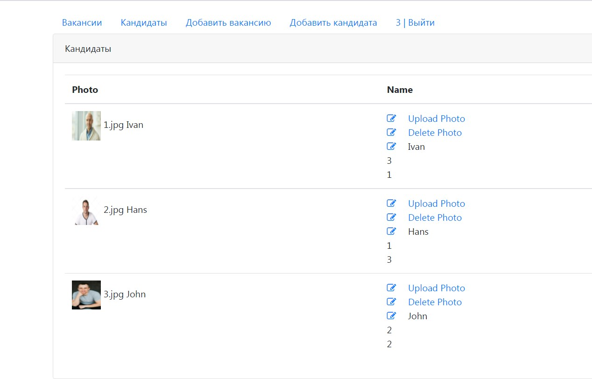
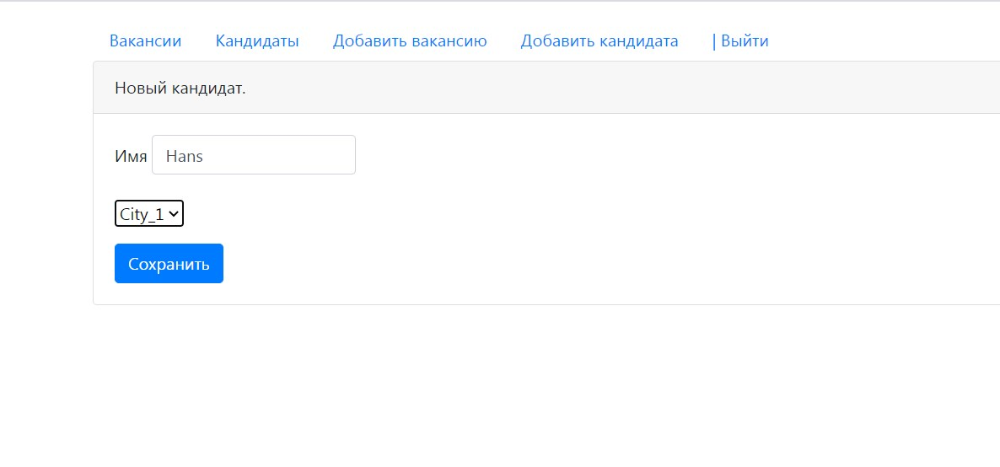
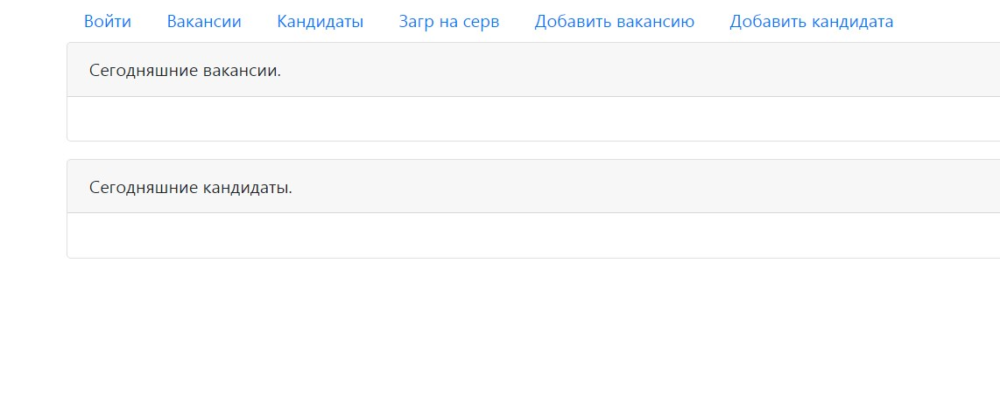
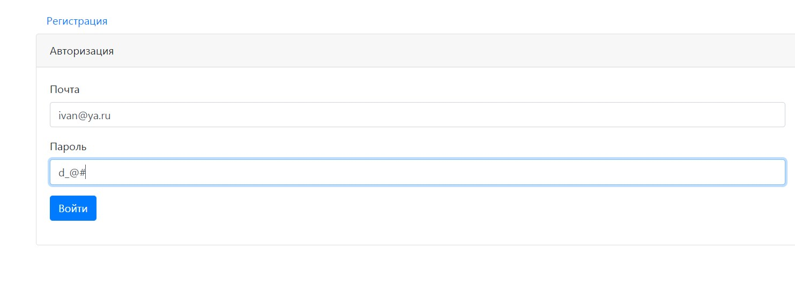

Dreamjob
=============

This project demonstrates the simple job center for programmers.
It uses next technologies: PostgreSQL, Maven, JSP, Servlets, JSTL, BootStrap4, AJAX.

List of the persons that what to search job. It contains a name, a photo and a location of the candidate. 

This screenshot shows the registration of new candidate.

This screenshot shows the home page of the site.

This screenshot shows the page of the authorisation.

